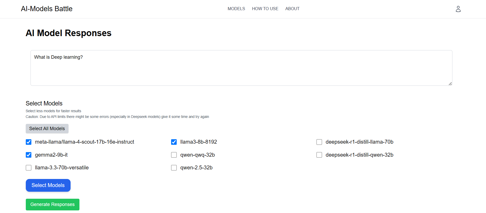
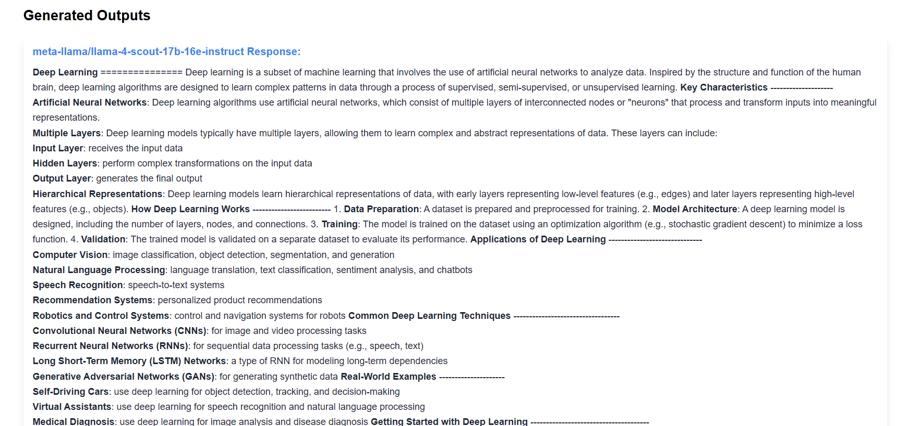
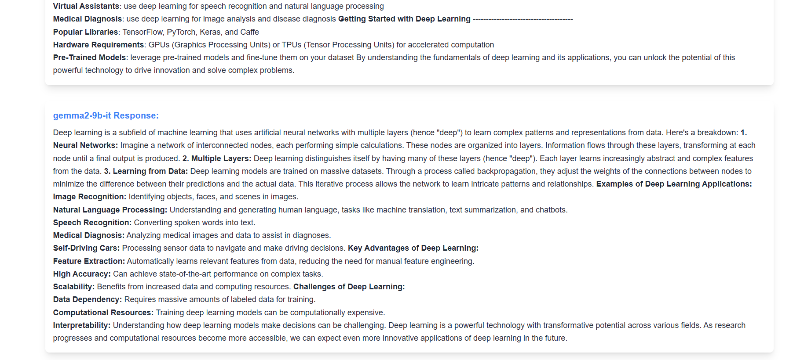
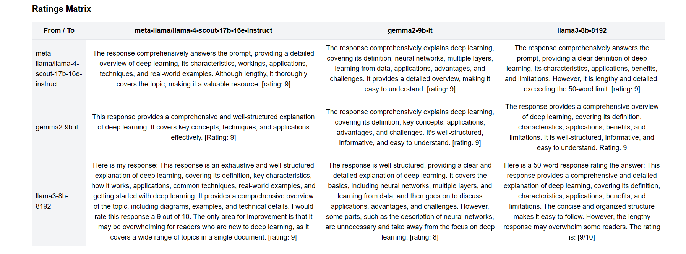

# 🧠 AI-Models Battle

---

## 🔗 Live Demo

- 🌐 **Demo:** [AI-Models Battle](https://multi-model-comparison.vercel.app/)

---

A fullstack web app that allows users to:
- 🔍 Submit prompts
- 🧾 Get responses from multiple AI models
- 📊 Let each model **rate the others**
- 🧮 View all ratings in a clear **matrix UI**

---

## 📈 Tech Stack

| Frontend | Backend | API     | Hosting |
|----------|---------|---------|---------|
| React    | FastAPI | Groq API | Vercel  |









---

## ✨ Features

- ✅ Prompt input and model selection
- ✅ Generates AI responses via the Groq API
- ✅ Peer-review: Each model rates all responses (including its own)
- ✅ Beautiful rating matrix for visualization
- ✅ FastAPI backend + React frontend
- ✅ Vercel deployment (fully serverless)

---


## ⚙️ Setup Instructions

### 🔧 Backend (FastAPI)

```bash
cd backend
python -m venv venv
source venv/bin/activate  # or venv\Scripts\activate on Windows
pip install -r requirements.txt
```

Create a .env file:
GROQ_API_KEY=your_groq_api_key

Start server:
uvicorn main:app --reload

### 💻 Frontend (React + Vite)
cd frontend
npm install
npm run dev

## 🌍 Deployment (Vercel)
### 🟩 Frontend

#### Root directory: frontend

#### Build command: npm run build

#### Output directory: dist

### 🟦 Backend

#### Root directory: backend

#### Build command: pip install -r requirements.txt

#### Output command: uvicorn main:app --host 0.0.0.0 --port 8000

### Environment Variables:

#### GROQ_API_KEY → Your API key from Groq Console

## 📌 Future Plans
### ⏳ Response comparison scoring (relevance, clarity, creativity)

### 💾 Save session history

### 🧑‍🏫 Leaderboard-style result page

### 🧙‍♂️ Model avatars and metadata display


## 📄 License

This project is licensed under the [GNU General Public License v3.0](https://www.gnu.org/licenses/gpl-3.0.html).  
See the [LICENSE](./LICENSE) file for details.

